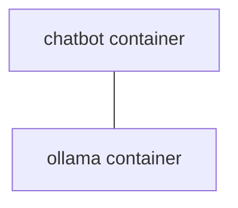

# ollama_rag_sample

このリポジトリは OLLAMA とローカル埋め込みを組み合わせた RAG（Retrieval-Augmented Generation）実験サンプルです。

docker コンテナで動作します。


## 概要

- フロントエンド: Streamlit アプリ (app.py)  
- 埋め込み: Sentence-Transformers  
- 検索: FAISS (IndexFlatIP)  
- LLM 実行: OLLAMA API 経由（`ollama_client.py`）  
- ドキュメント処理: PDF/TXT 読み取り & スライディングウィンドウ（`rag_loader.py`）  
- プロンプト管理: `prompts.yaml` にモデル別テンプレートを外部化

## クイックスタート

1. リポジトリをクローンする  
2. 必要に応じて .env を作成して OLLAMA_URL を設定する  
3. `docker-compose up -d` でサービスを起動する（モデルは起動後に pull する）
```bash
例)
docker exec -it ollama ollama pull gemma3

docker exec -it ollama ollama pull llama3

docker exec -it ollama ollama pull hf.co/mmnga/ELYZA-Shortcut-1.0-Qwen-7B-gguf
``` 

4. Streamlit にアクセスしてファイルをアップロードし、RAG を試す


## 主要ファイル

- `app.py` — Streamlit UI、ファイルアップロード、Index構築、チャット  
- `rag_loader.py` — PDF/TXT 読取、文分割、スライディングウィンドウ  
- `ollama_client.py` — Ollama API 呼び出しラッパ  
- `prompts.yaml` — モデル別テンプレート（template / empty_context / query_expansion）  
- `Dockerfile.chatbot` / `Dockerfile.ollama` / `docker-compose.yml` — ローカル開発用  
- `requirements.txt` — Python 依存パッケージ

## 構造 

### コンポーネント

- Streamlit UI: モデル選択、RAG ON/OFF、Query Expansion ON/OFF 、Similarity Threshold(類似度)  
- Chunker: 文分割 + スライディングウィンドウ（`rag_loader.py`）
  - 文単位で分割し、スライディングウィンドウで重複を持たせて文脈保持を図る
- Retriever: SentenceTransformer → FAISS IndexFlatIP 
- LLM 層: `prompts.yaml` を読み込み `build_prompt` でプロンプト生成、`ollama_client.query_ollama` で実行
  - テンプレート外部化によりモデル切替や A/B 実験がしやすい構造になっている
  - `prompts.yaml` にモデル別テンプレートを外部化しており、`app.py` の `build_prompt` で model 名に応じて選択・置換しています。各モデルは次のフィールドを持ちます:
    - `template` — 文脈ありのプロンプト  
    - `empty_context` — 文脈がない場合のプロンプト  
    - `query_expansion` — 検索用に質問を拡張するテンプレート（任意）

gemma3 日本語テンプレート（例）

```yaml
gemma3:
  template: |
    <|system|>
    あなたは親切で有能なアシスタントです。

    <|user|>
    以下の文脈を参考にして、質問に答えてください。

    文脈:
    {{context}}

    質問:
    {{query}}

  empty_context: |
    <|system|>
    あなたは親切で有能なアシスタントです。

    <|user|>
    以下の質問に答えてください。
    質問:
    {{query}}

  query_expansion: |
    <|system|>
    あなたは親切で有能なアシスタントです。

    <|user|>
    以下の質問を検索に適した形で意味的に拡張してください。

    質問: {{query}}
```

### データフロー

1. 文書 → チャンク化 → 埋め込み → FAISS に格納  
2. ユーザー質問 → Query Expansion（拡張）→ 埋め込み → top_k 検索 → threshold フィルタ
  - チャンク境界や粒度、短いクエリが原因で検索精度が不安定になる。Query Expansion　で対応
3. 上位結果をコンテキスト化してモデルに投げ、回答を取得


## 免責と注意点

- 実験用サンプルです。
