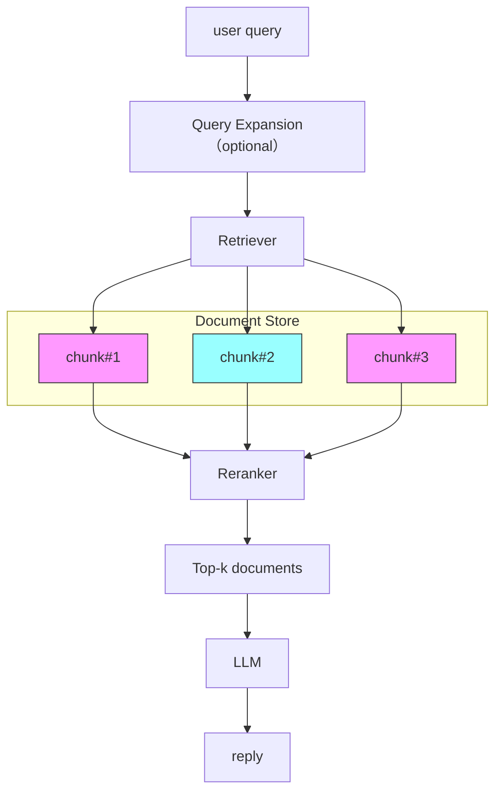

# RAG Chatbot with File Upload (LangChain version)

This project is a sophisticated, containerized chatbot application that leverages the power of Retrieval-Augmented Generation (RAG) to answer questions based on a knowledge base of uploaded documents. It is built using Python, Streamlit, LangChain, and Ollama.

## Disclaimer

This is an educational and demonstrational project. It is intended to showcase the implementation of a RAG chatbot using modern tools and is not meant for production use without further development and testing.

## Features

* **Chatbot Interface:** A user-friendly, web-based chat interface built with Streamlit.
* **Document Upload:** Supports uploading PDF and text files to build a dynamic knowledge base.
* **Local LLM with Ollama:** Utilizes a local large language model via Ollama for text generation, ensuring privacy and control.
* **RAG Pipeline:** Implements a full RAG pipeline with document loading, text splitting, embedding, and retrieval.
* **Advanced Retrieval:**
    * Uses FAISS for efficient similarity search.
    * Includes an optional re-ranking step with a cross-encoder for improved accuracy.
* **Query Expansion:** Enhances user queries for more relevant search results.
* **Configurable:** Easily configurable through environment variables and a YAML file for prompts.



## Architecture

The application is composed of two main services, orchestrated by Docker Compose:

* **`ollama`:** The backend service that runs the large language model. It uses the official `ollama/ollama` Docker image.
* **`chatbot`:** The main application service that contains the Streamlit user interface and the RAG pipeline logic.

## Setup and Installation

### Prerequisites

* Docker
* Docker Compose

### Installation

1.  **Clone the repository:**
    ```bash
    git clone https://github.com/atsushi3hsgw/ollama_rag_sample.git
    cd ollama_rag_sample
    ```

2.  **Build and run the services:**
    ```bash
    docker-compose up --build
    ```
3.  **Pull the models:**
    ```bash
    examples)
    docker exec -it ollama-container ollama pull gemma3
    docker exec -it ollama-container ollama pull llama3
    docker exec -it ollama-container ollama pull hf.co/mmnga/ELYZA-Shortcut-1.0-Qwen-7B-gguf
    ```

4.  **Access the application:**
    Open your web browser and navigate to `http://localhost:8501`.

## Usage

1.  **Select a model:** Choose a model from the dropdown menu in the sidebar.
2.  **Configure RAG settings:** Adjust the RAG settings in the sidebar to enable or disable features like query expansion and document retrieval.
3.  **Upload documents:** Upload your PDF or text files to build the knowledge base. Click the "Add Documents" button to index them.
4.  **Chat:** Ask questions in the chat input field. The chatbot will use the uploaded documents to provide answers.

## Configuration

### Docker Compose (`docker-compose.yml`)

The `docker-compose.yml` file defines the services and their configurations. Key environment variables for the `chatbot` service include:

* `OLLAMA_URL`: The URL of the Ollama service.
* `EMBEDDING_MODEL`: The Hugging Face model to use for text embeddings.
* `RAG_INDEX_DIR`: The directory to store the RAG index.
* `PROMPTS_PATH`: The path to the YAML file containing the prompts.
* `CROSS_ENCODER_MODEL`: The Hugging Face cross-encoder model.

### Prompts (`prompts_langchain.yml`)

This file contains the prompts used by the LangChain chains for different tasks:

* `query_expansion_messages`: Prompts for expanding user queries.
* `rag_prompt_messages`: Prompts for the RAG chain.
* `simple_prompt_messages`: Prompts for the simple, non-RAG chain.

### Dependencies (`requirements.txt`)

The project's Python dependencies are listed in `requirements.txt`. These are installed when building the `chatbot` Docker image.

### Dockerfiles

* **`Dockerfile.ollama`:** The Dockerfile for the `ollama` service, based on the official `ollama/ollama` image.
* **`Dockerfile.chatbot`:** The Dockerfile for the `chatbot` service. It uses a Python 3.11 base image, installs the dependencies, and runs the Streamlit application.

## License

This project is freely available for personal and commercial use. You are welcome to use, modify, and distribute the code as you see fit. No warranty is expressed or implied.
